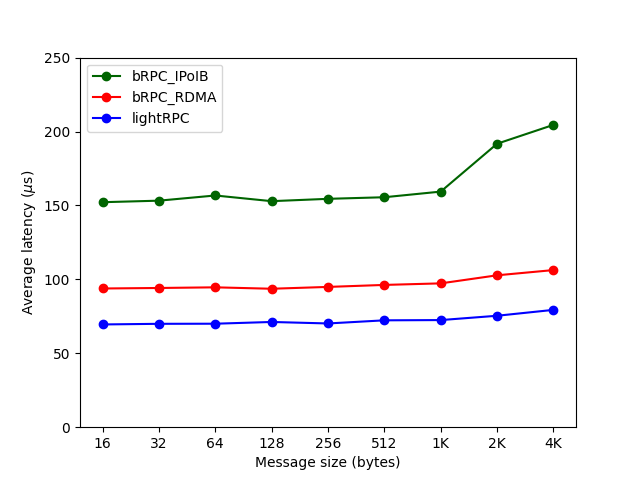
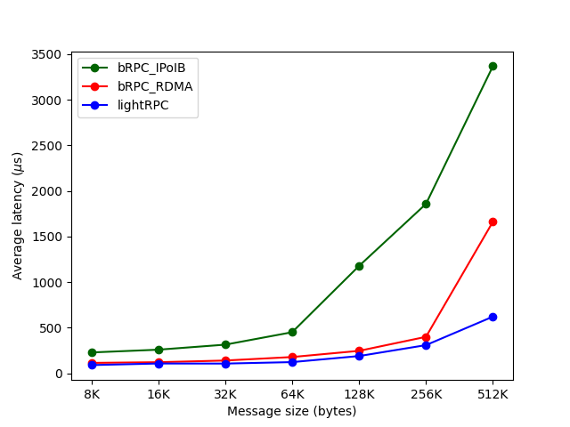
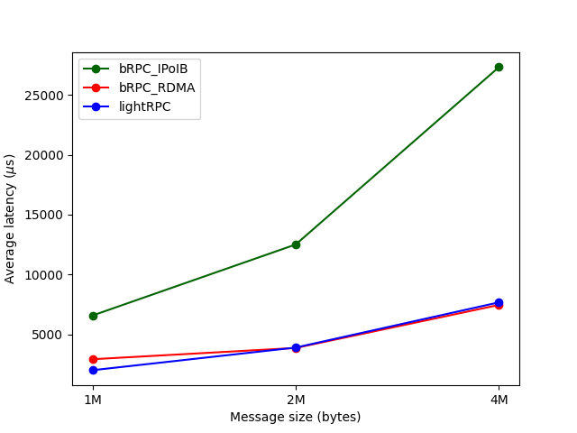

# LightRPC
A Light and Efficient RDMA-based RPC Framework

### 引言

事实上，基于RDMA构建RPC在学术界有很多优秀的工作，例如：Herd（SIGCOMM14），RFP（EuroSys17），ScaleRPC（EuroSys19），eRPC（NSDI19），Flock（SOSP21），HatRPC（SC21）等等。这些工作都具有创新性，都在解决他们所提出的难题。但是其中许多工作也隐藏着许多的“问题”（除了Anuj Kalia大佬会开源，其他基本都没有），会让人觉得：这个设定或者这个方法真的能用到生产中吗？举个简单的例子：

* RFP的前半部分我觉得特别好，但是关于客户端如何去获取RPC响应的讨论，我不是很认同。对于服务端，入站的性能好于出站，所以客户端read好于服务端write（观点：在某些场景下，确实是这样）。由于客户端不知道何时read响应，所以引入了一个启发式的算法（观点：如果客户端的CPU资源可以任意浪费，这样确实也可以，但是仍然有个问题是：这个响应占用的内存不需要释放吗？服务端怎么知道客户端read完毕呢？）。

因此，做LightRPC的想法是：作为学院派，能不能在考虑性能的同时，兼顾生产场景中的需求呢？在提升通用性的同时，如何优化RDMA的使用流程呢？由于能力以及时间原因，LightRPC同样只是个toy，但是也包含了自己独有的思考。

关于对比对象，我们选择了bRPC（百度开源的RPC框架，也是Apache下的顶级项目，支持RDMA协议，一个非常优秀且用心的RPC框架）。需要说明的是，bRPC面向的是多样的生产环境，对稳定性、适用性的考虑肯定高于性能，所以这并不是一个公正的对比，仅作参考即可。

### 设计方案

1. 为了支持任意大小的RPC请求与响应，我们需要对时延、内存占用、CPU消耗量进行权衡。简单而言，我们将所有的消息按照大小分为三类，默认设置下，是以4k以及1M为分界点，这三类消息使用了不同的传输策略（其中后两者的区别相对较小）。

### 实验测试

一、单个客户端与服务端（单线程）

实验设置：（1）使用同步echo服务，即客户端发送什么，服务端就返回什么，同步意味着客户端发送请求后会等待响应的返回。（2）消息大小从16字节到4M字节，对于每种消息大小，客户端均发送2万次请求，计算平均时延。（3）由于测试机器为NUMA架构，共有两个NUMA节点，IB网卡位于其中一个节点，所以该项测试会将进程绑定到IB网卡所在的NUMA节点。结果如下：

分析：1M之前，性能好于bRPC，1M之后，基本相同。事实上，大消息对时延的容忍度更高，所以吞吐量更为重要。